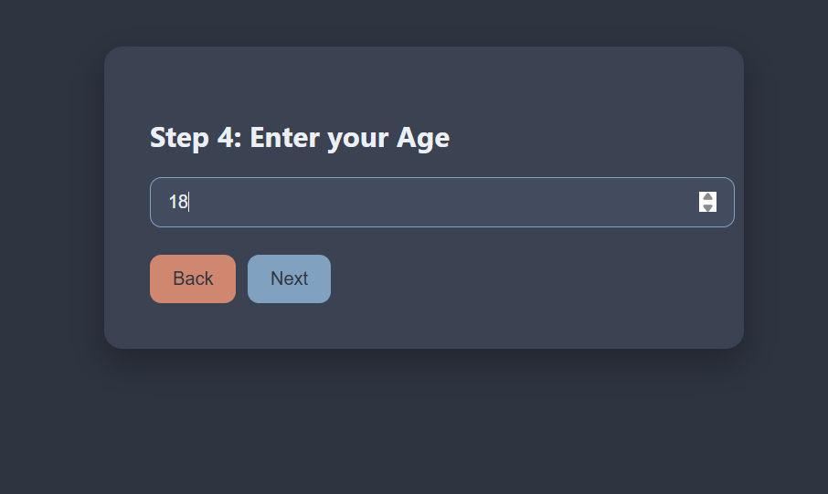
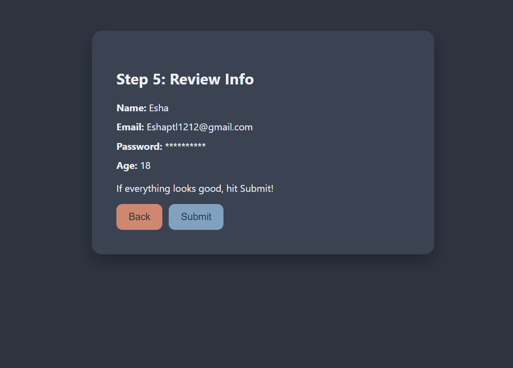

# 🧾 Multi-Step Form (React)

A clean and elegant **multi-step form** built using React. Navigate through 4–5 steps to input user data with a stylish layout and smooth interactions.

---

## 📌 Features
- ✅ **Step-by-Step Navigation**: Go forward and back through the form steps.
- ✅ **State Management**: Uses `useState` for handling form data.
- ✅ **Modular Components**: Each step lives in its own file for clarity and reusability.
- ✅ **CSS Styling**: Styled with a classy custom theme using an external CSS file.
- ✅ **Form Summary**: Final step shows submitted data for confirmation.

---

## 🛠️ Technologies Used
- ⚛️ **React** (`useState`, JSX)
- 🎨 **CSS** (`Form.css` for form design & layout)
- 🧱 **Modular Structure** (Each step in its own component)

---

## 🚀 Live Demo
To see it in action, clone the repository and follow the setup instructions below.

1. **Clone the repository:**

   ```bash
   git clone  https://github.com/Eshhaa11/multi-step-form
   
   
2. **Navigate to the project directory:**

   cd  multi-step-form

3. **Install dependencies:**

   npm install

4. **Start the development server:**

   npm start

5. **Open your browser and visit:**

   http://localhost:3000

---

 ## 🎨 Screenshots:
 
 

 ---

 ## 🤝 Contributing:
 Want to improve this project? Fork the repository, create a feature branch, and open a pull request. All contributions are welcome! 🚀✨
 
 ---

 🎉 Happy Coding!